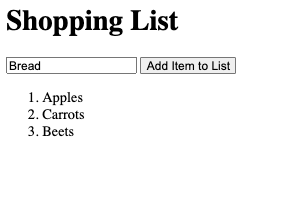
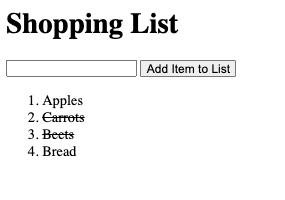

# Simple Shopping list

[Live Site](https://dveytsman.github.io/simple-shopping-list/)

## Purpose:

I wanted to create a simple shopping list using the original front end methods, pre react and other new frameworks. This project uses vanilla js, html and css.

## Functionality:

1. Adding Items: Type the new item into the input and either hit the enter key or click the button.
2. Toggle completion: To mark an item as done or incomplete, click on the list item to be modified.

### Screenshots:

